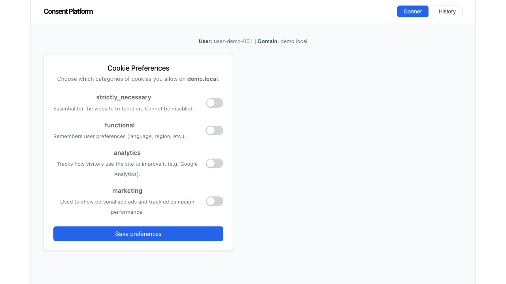
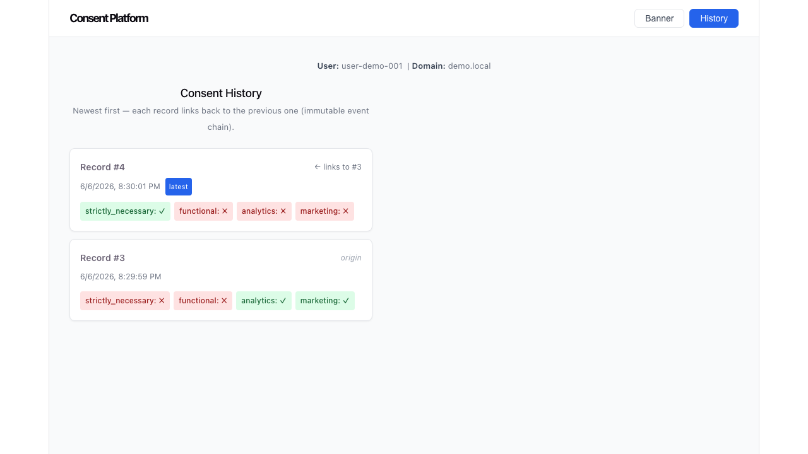

# Consent Management Platform

A full-stack web application for recording and auditing user cookie consent preferences. Built from scratch to explore real-world requirements around data privacy compliance (GDPR / CCPA).

## What it does

When a user visits a website, they are typically shown a cookie banner asking which categories of data collection they allow. This platform handles the full lifecycle of that interaction:

- **Consent Banner** — a UI where users toggle on/off each cookie category and save their preferences; pre-populated from the user's last saved state on return visits
- **Immutable audit trail** — every preference change is stored as a new event, never an edit; each record links back to the previous one forming a verifiable chain
- **Consent History** — a view showing every consent event for a user, newest first, with the chain of changes visible
- **API key auth** — each client (website) has a scoped API key; a key for `shop.com` cannot read or write data for `bank.com`

This design mirrors how real consent management platforms work: consent data must be tamper-proof so a company can prove exactly what a user agreed to and when.

## Screenshots

**Consent Banner** — loads categories live from the API; pre-populated from last saved preferences:



**Consent History** — immutable event chain, each record links to the previous:



## Tech stack

| Layer | Technology | Purpose |
|---|---|---|
| Backend API | Python, FastAPI | HTTP server and request routing |
| Database ORM | SQLModel (SQLAlchemy + Pydantic) | Maps Python classes to DB tables |
| Database | PostgreSQL | Persistent storage with concurrent writes |
| Cache | Redis | In-memory cache for `GET /consent/latest` |
| Task queue | Celery (broker: Redis) | Async consent writes in a separate worker process |
| Frontend | React, TypeScript, Vite | Consent banner and history UI |
| API docs | Swagger UI (auto-generated) | Interactive docs at `/docs` |

## Architectural principles

### 1. Immutable event chain

Consent records are **never edited or deleted**. Each time a user changes their preferences, a new record is created that points back to the previous one via `previous_record_id`. This forms a linked list through the database:

```
ConsentRecord #1  (previous = null)       ← origin
  └── analytics: true, marketing: true

ConsentRecord #2  (previous = #1)
  └── analytics: true, marketing: false   ← user opted out of marketing

ConsentRecord #3  (previous = #2)
  └── analytics: false, marketing: false  ← user opted out of everything
```

To get current consent → query the record with the highest ID for that user and domain.  
To audit past consent → follow `previous_record_id` back through the chain.

This satisfies a core compliance requirement: you can prove exactly what a user consented to at any point in time. No UPDATE or DELETE ever touches these records.

### 2. Thin write path (async processing)

When a user submits their preferences, `POST /consent` returns a `202 Accepted` response in microseconds — it does not wait for the database write to finish. The write is handed off to a **Celery worker** running as a separate process:

```
Browser → POST /consent → Redis queue → 202 back instantly
                               ↓
                      Celery worker process
                               ↓
                      Writes to PostgreSQL + invalidates cache
```

This keeps the write path thin, matching the real-world requirement that a consent API must never slow down the customer's website.

### 3. Cache-aside for reads

`GET /consent/latest` is called on every page load — the hottest endpoint in the system. Results are cached in Redis per `user_identifier + domain`:

- **Cache hit** → return in-memory JSON, no database query
- **Cache miss** → query PostgreSQL, store in Redis with a 5-minute TTL, return result
- **On new submission** → Celery worker deletes the cache key so the next read rebuilds from the fresh row

### 4. Per-domain API key authorization

Every client (website) registers and receives an API key scoped to their domain. Every protected request must include the key in the `X-API-Key` header. The server checks two things:

1. **Authentication** — does this key exist? (401 if not)
2. **Authorization** — does this key's domain match the requested domain? (403 if not)

This prevents a key issued for `shop.com` from reading or writing `bank.com`'s user data.

## Data models

```
ConsentCategory     — the types of cookies (analytics, marketing, etc.)
ConsentRecord       — one immutable consent event per user interaction
ConsentDecision     — the yes/no answer for one category within one record
APIClient           — a registered website with an API key scoped to one domain
```

## API endpoints

| Method | Endpoint | Auth | Description |
|---|---|---|---|
| `GET` | `/health` | Public | Server health check |
| `GET` | `/consent/categories` | Public | List all consent categories |
| `POST` | `/consent` | Required | Enqueue a new consent event (returns 202) |
| `GET` | `/consent/latest` | Required | Get a user's current (most recent) consent |
| `GET` | `/consent/history` | Required | Get a user's full consent audit trail |

Interactive docs at `http://localhost:8000/docs` when running locally.

## Project structure

```
consent-platform/
├── backend/
│   ├── app/
│   │   ├── main.py          # FastAPI app, CORS, lifespan handler
│   │   ├── database.py      # PostgreSQL engine and session factory
│   │   ├── models.py        # SQLModel table definitions
│   │   ├── schemas.py       # Pydantic request/response shapes
│   │   ├── auth.py          # API key validation dependency
│   │   ├── cache.py         # Redis client and cache key helper
│   │   ├── celery_app.py    # Celery configuration (broker: Redis)
│   │   ├── tasks.py         # write_consent_record async task
│   │   └── routers/
│   │       └── consent.py   # All /consent API routes
│   ├── seed.py              # Seeds consent categories and test API clients
│   └── requirements.txt
└── frontend/
    └── src/
        ├── api.ts               # All fetch() calls in one place
        ├── App.tsx              # Nav shell, view switching, state lifting
        ├── ConsentBanner.tsx    # Toggle UI + submit
        └── ConsentHistory.tsx   # Audit chain table
```

## Running locally

**Prerequisites:** Python 3.11+, Node.js 18+, PostgreSQL 16, Redis

### Infrastructure

```bash
# Install and start PostgreSQL
brew install postgresql@16
brew services start postgresql@16
createdb consent_platform

# Install and start Redis
brew install redis
brew services start redis
```

### Backend

```bash
cd backend
python -m venv venv
source venv/bin/activate        # Windows: venv\Scripts\activate
pip install -r requirements.txt
python seed.py                  # seeds categories and a test API client (run once)
uvicorn app.main:app --port 8000 --reload
```

### Celery worker (separate terminal)

```bash
cd backend
source venv/bin/activate
celery -A app.celery_app worker --loglevel=info
```

### Frontend

```bash
cd frontend
npm install
npm run dev
```

Open `http://localhost:5173`. The test API key for local dev is `demo-api-key-local` (seeded automatically, scoped to `demo.local`).

## Build diary

[COMMAND_LOG.md](COMMAND_LOG.md) is a step-by-step log of how this project was built — each step explains what was done, why, and what concepts it demonstrates. Written to be readable cold, without the original conversation.
